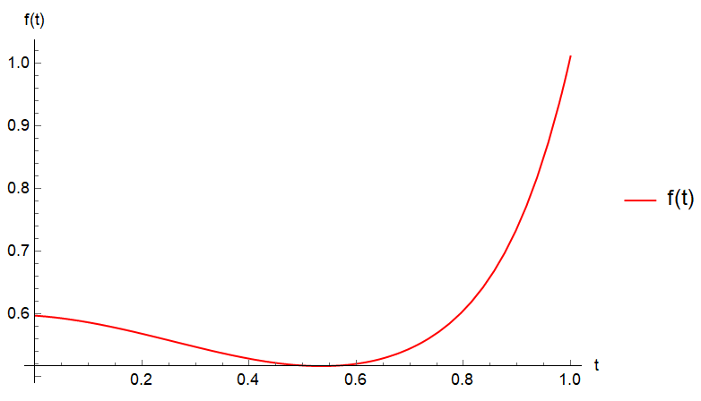
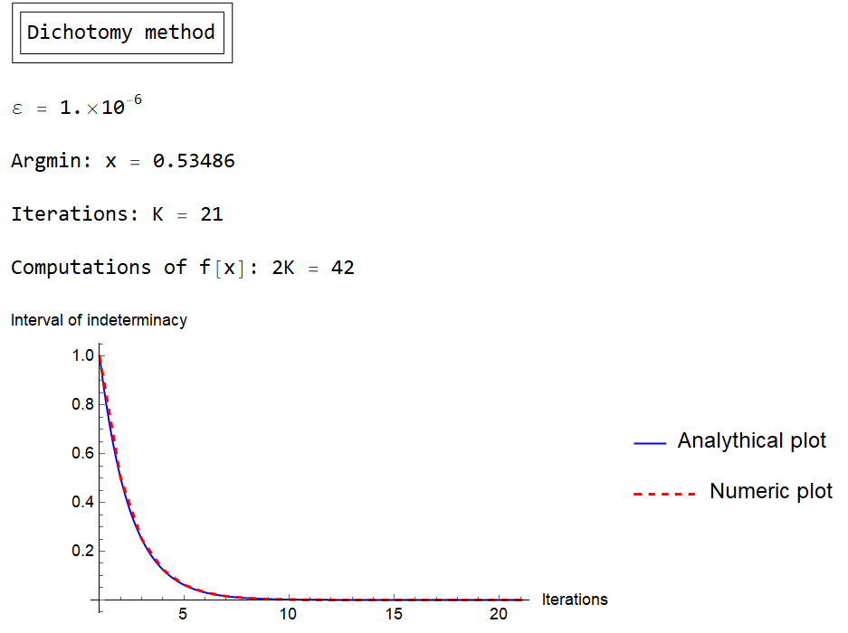
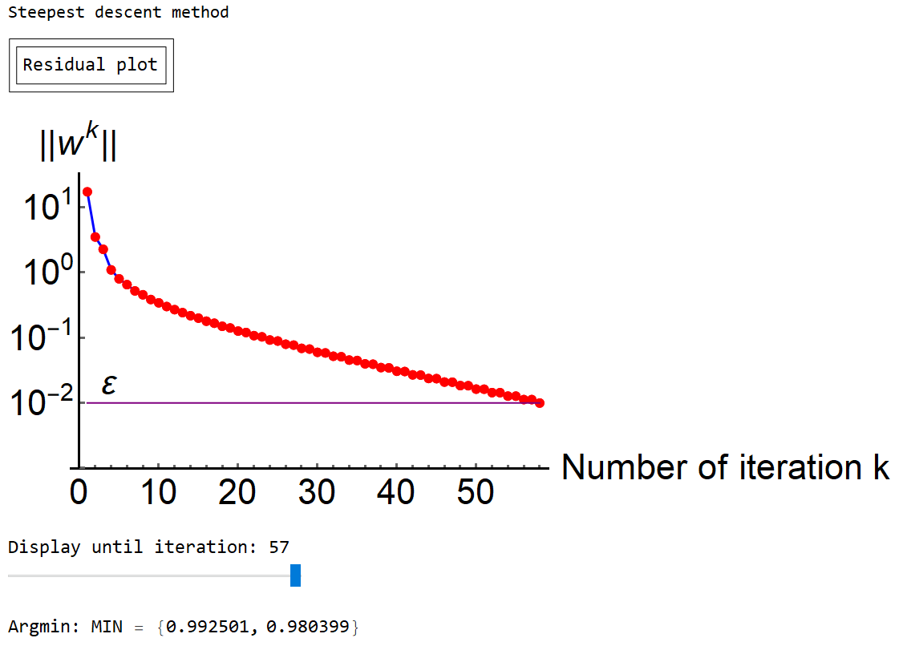
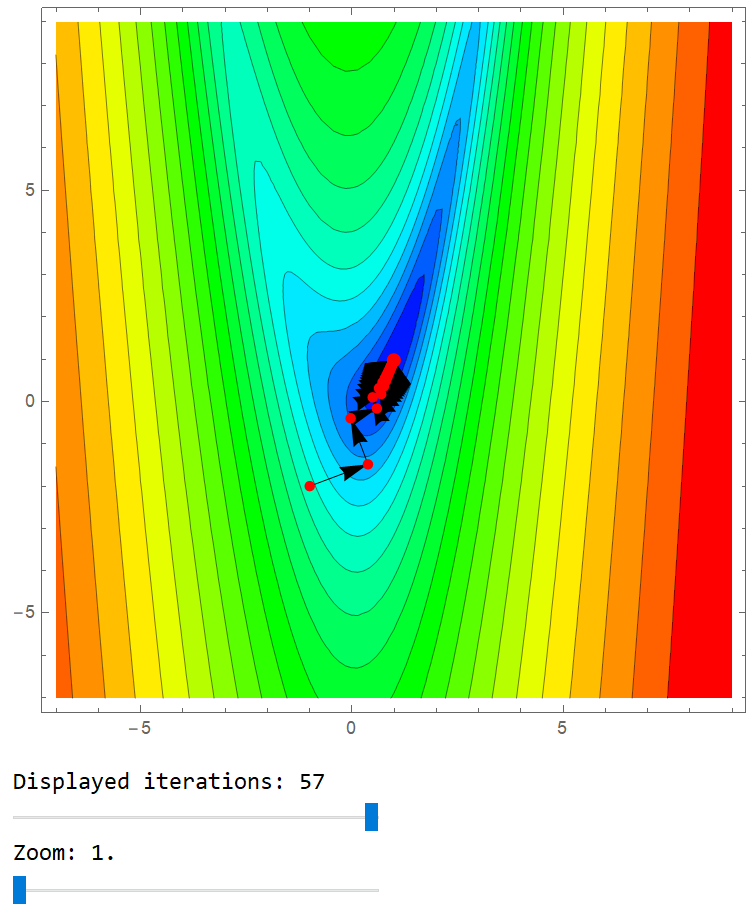
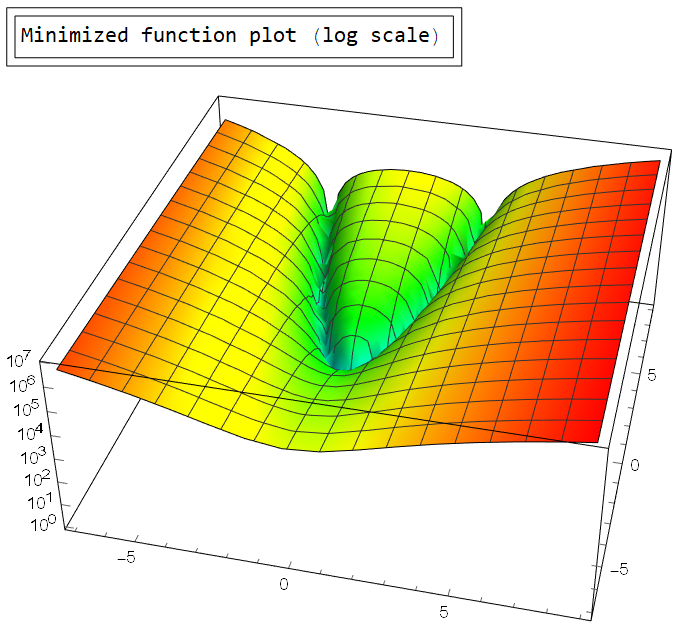
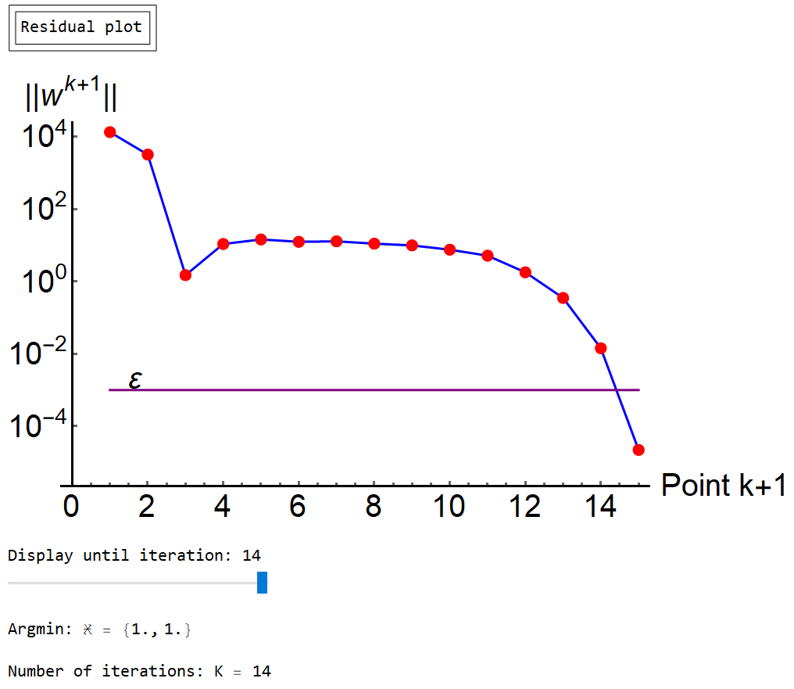
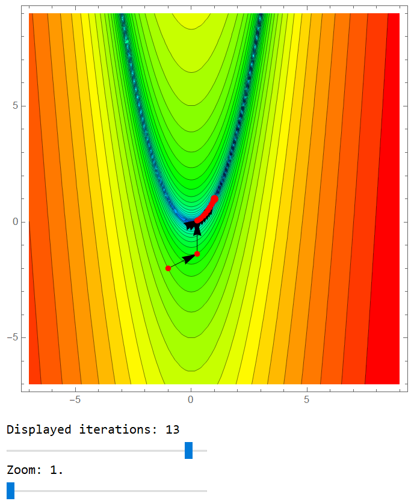
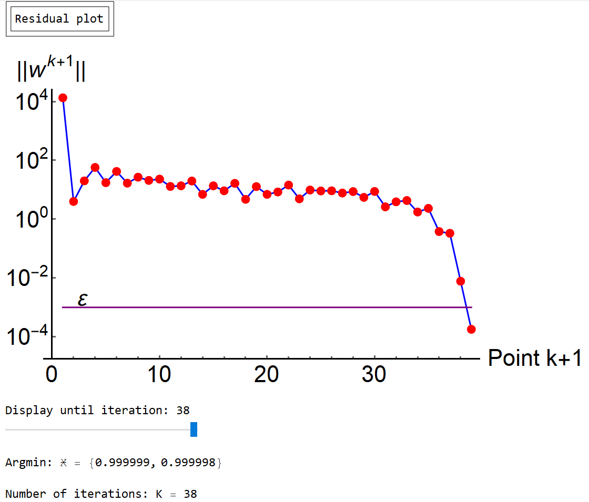
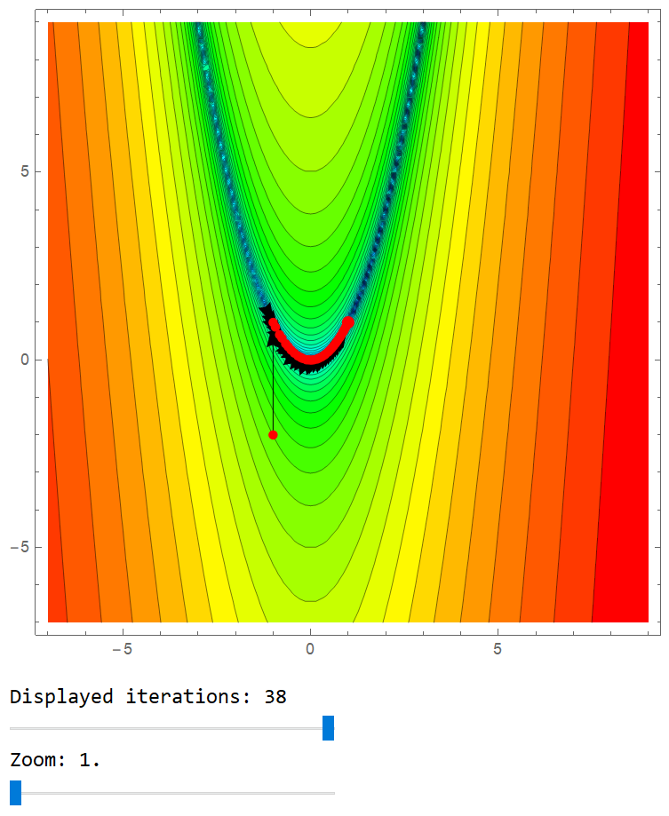

# Optimization methods collection

Contains various minimization methods in 7 Wolfram Mathematica packages:

* Package 1
    * Dichotomy method
    * Golden-section search

* Package 2
    * Steepest descent
    * Gradient descent with geometric step reduction

* Package 3
    * Nonlinear conjugate gradient method
    * Fletcher-Reeves method
    * Polak-Ribière method
    * Nonlinear conjugate gradient method with Hessian matrix

* Package 4
    * Newton' s method
    * Modified Newton' s method with step reduction

* Package 5
* Package 6
* Package 7
* Package 8

## Package 1 examples
Minimization of a single argument function on a given interval. Both methods have exponential convergence.

## Package 2 examples
Minimization of a 2-argument function from a given initial point. Rosenbrock function is used for testing, minization process can be dynamically tracked. All consequent plots support dynamics. Following example showcases steepest descent method.

## Package 3 examples
Minimization of a 2-argument function from a given initial point. Rosenbrock function is used for testing, minization process can be dynamically tracked. All consequent plots support dynamics. Following example showcases nonlinear conjugate gradient method with Hessian matrix.

## Package 4 examples
Minimization of a 2-argument function from a given initial point. Rosenbrock function is used for testing, minization process can be dynamically tracked. All consequent plots support dynamics. Following example showcases modified Newton' s method with step reduction.

## Package 5 examples
## Package 6 examples
## Package 7 examples
## Package 8 examples

## Usage

## Requirements

To launch Mathematica packages one may need a valid Wolfram Mathematica license. As an alternative packages can be converted to Jypiter notebooks and executed with Wolfram Lang.

## Version History

* 00.03
    * Translated package 4, converted notebook to Mathematica package

* 00.02
    * Translated package 3, converted notebook to Mathematica package

* 00.01
    * Translated package 1, altered some plotting methods, converted notebook to Mathematica package
    * Translated package 2, altered some plotting methods, converted notebook to Mathematica package

## License

This project is licensed under the MIT License - see the LICENSE.md file for details
