# Optimization methods collection

Contains various minimization methods in 8 Wolfram Mathematica packages:

* Package 1 (1-dimensional dichotomy)
  * Dichotomy method
  * Golden-section search

* Package 2 (gradient descent methods)
  * Steepest descent
  * Gradient descent with geometric step reduction

* Package 3 (nonlinear conjugate gradient methods)
  * Nonlinear conjugate gradient method
  * Fletcher-Reeves method
  * Polak-Ribière method
  * Nonlinear conjugate gradient method with Hessian matrix

* Package 4 (Newton's methods)
  * Newton's method
  * Modified Newton's method with step reduction

* Package 5 (Quasi-Newton methods)
  * Davidon-Fletcher-Powell method
  * Broyden-Fletcher-Goldfarb-Shanno method
  * Powell method
  * McCormick method

* Package 6 (direct search methods)
  * Cyclic coordinate descent
  * Pattern search (Hooke - Jeeves method)
  * Rosenbrock method
  * Powell method

* Package 7 (simplex methods)
  * Regular simplex method
  * Downhill simplex method (Nelder-Mead method)

* Package 8 (barrier methods)
  * Interior penalty function method
  * Exterior penalty function method

## Package 1 (1-dimensional dichotomy) examples

Minimization of a single argument function on a given interval. Both methods have exponential convergence.

## Package 2 (gradient descent methods) examples

* Requires gradient to be present and computable

Minimization of a 2-argument function from a given initial point. Rosenbrock function is used for testing, minization process can be dynamically tracked. All consequent plots support dynamics. Following example showcases steepest descent method.

## Package 3 (nonlinear conjugate gradient methods) examples

* Requires gradient to be present and computable
* Conjugate gradient methods can follow narrow (ill-conditioned) valleys, where the steepest descent method slows down and follows a criss-cross pattern

Minimization of a 2-argument function from a given initial point. Rosenbrock function is used for testing, minization process can be dynamically tracked. Following example showcases nonlinear conjugate gradient method with Hessian matrix.

## Package 4 (Newton's methods) examples

* Requires Hessian to be present and computable
* Newton's method can minimize any polynomial of Nth order in N-1 steps

Minimization of a 2-argument function from a given initial point. Rosenbrock function is used for testing, minization process can be dynamically tracked. Following example showcases modified Newton's method with step reduction.

## Package 5 (Quasi-Newton methods) examples

* Quasi-Newton methods (except McCormick) keep most properties of a regular Newton's method without requiring Hessian computation

Minimization of a 2-argument function from a given initial point. Rosenbrock function is used for testing, minization process can be dynamically tracked. Following example showcases Powell method. 

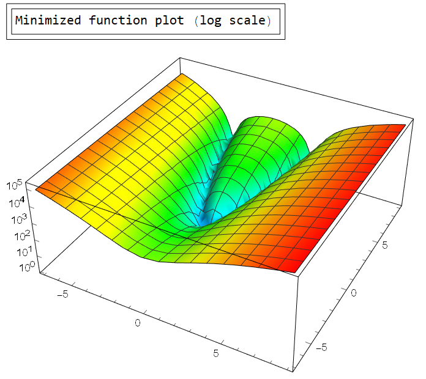

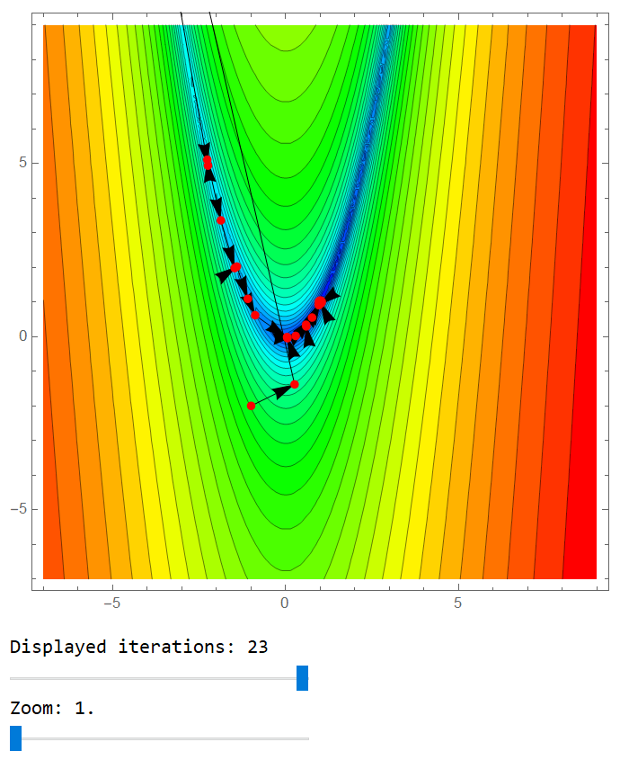

## Package 6 (direct search methods) examples

* Direct search methods do not require a gradient, thus can be used with non-continuous and non-differentiable functions

Minimization of a 2-argument function from a given initial point. Rosenbrock function is used for testing, minization process can be dynamically tracked. Following example showcases cyclic coordinate descent.

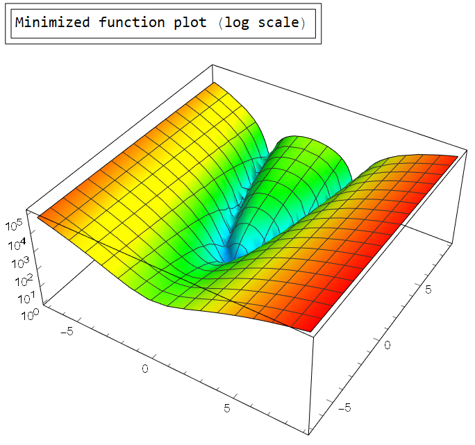

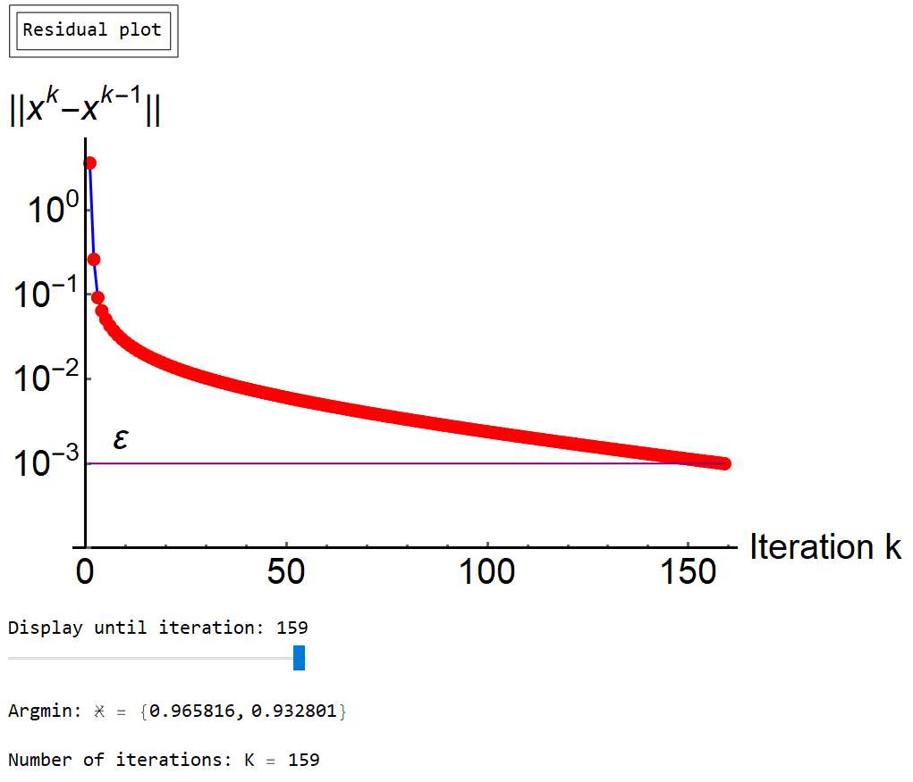

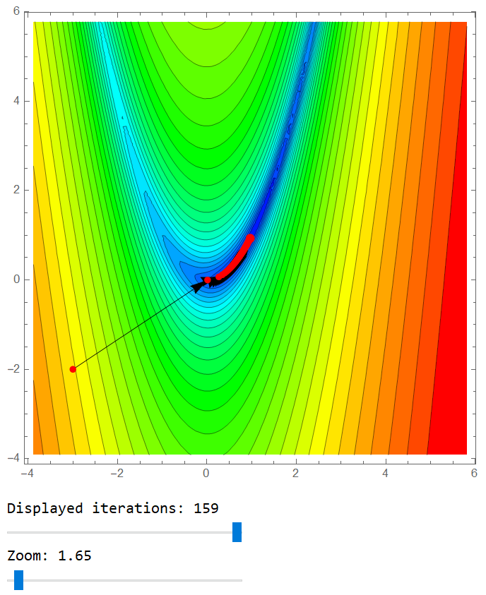

## Package 7 (simplex methods) examples

* Simplex methods do not require a gradient, thus can be used with non-continuous and non-differentiable functions

Minimization of a 2-argument function from a given initial point. Rosenbrock function is used for testing, minization process can be dynamically tracked. Following example showcases Nelder-Mead method.

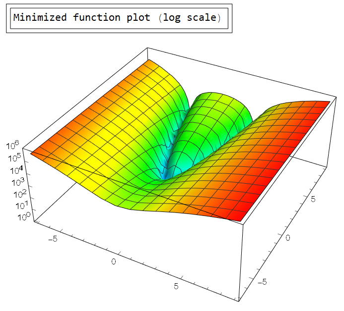

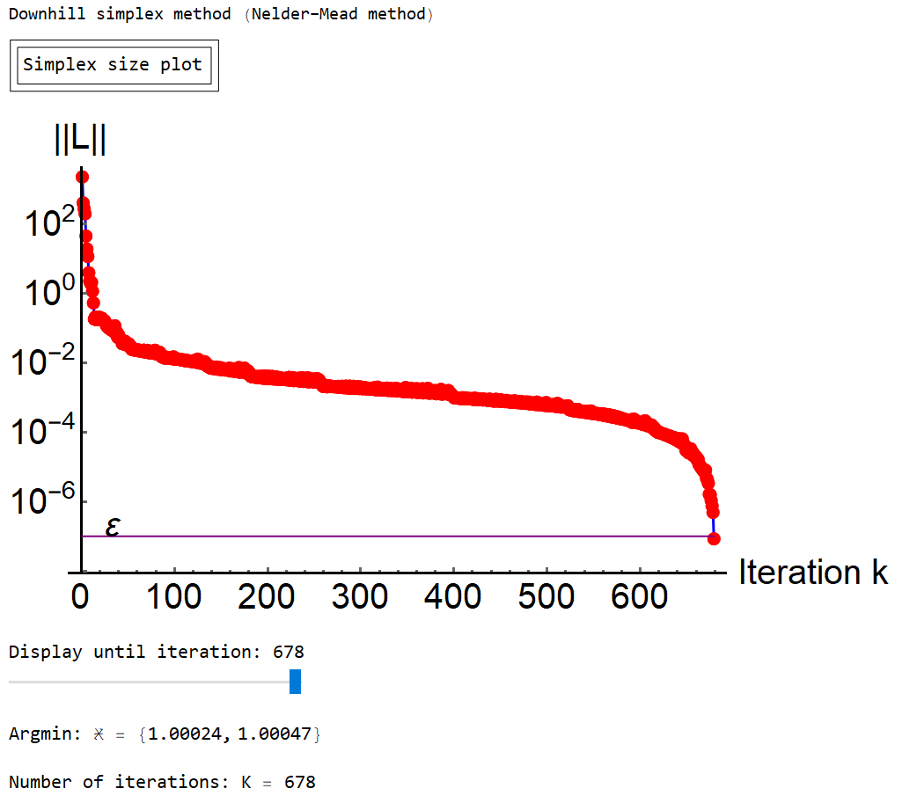

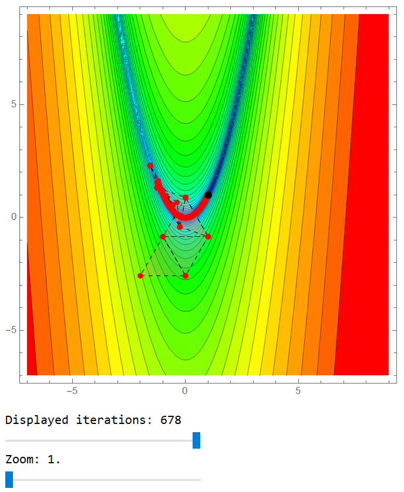

## Package 8 (barrier methods) examples

* Barrier methods use penalty functions to restrict minimization to a given region g(x, y) < 0
* Through generally reliable, a large step enough can overshoot the barrier, which leads to a longer convergence

Minimization of a 2-argument function from a given initial point restricted to a region. Rosenbrock function is used for testing. Following example showcases exterior barrier method.

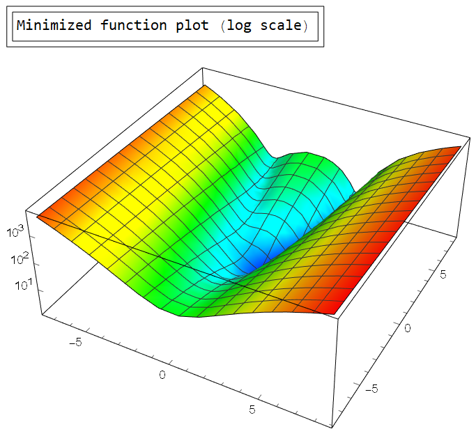

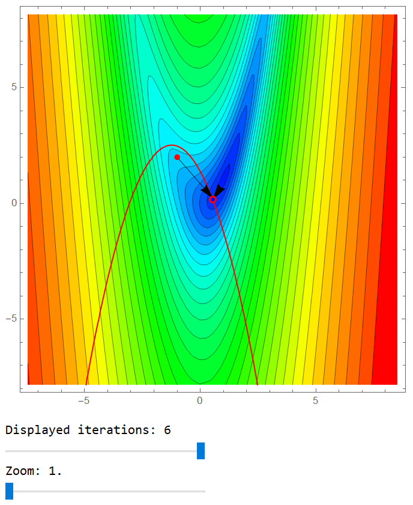

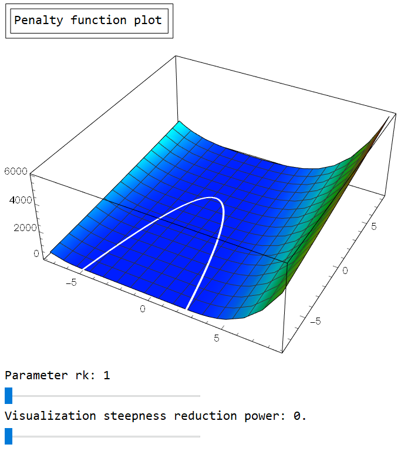

The same problem with interior barriers:

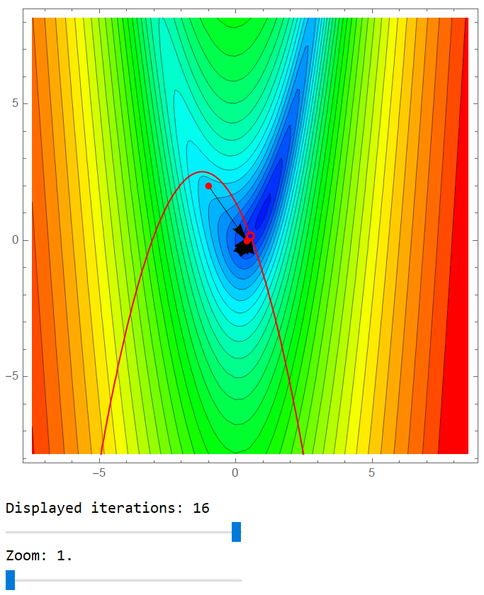

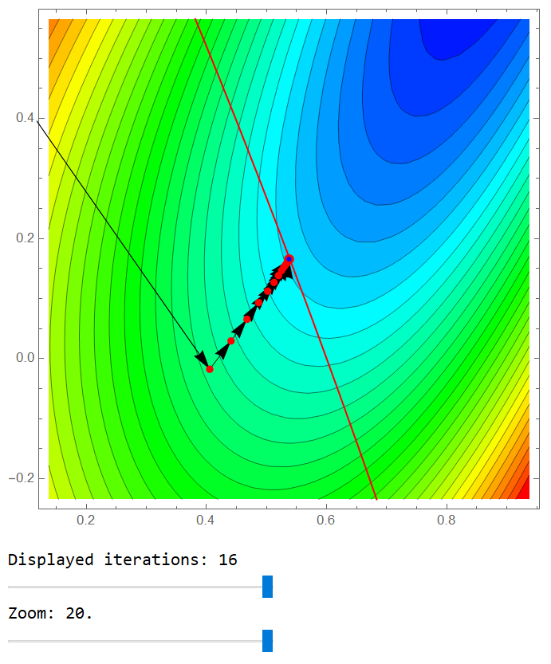

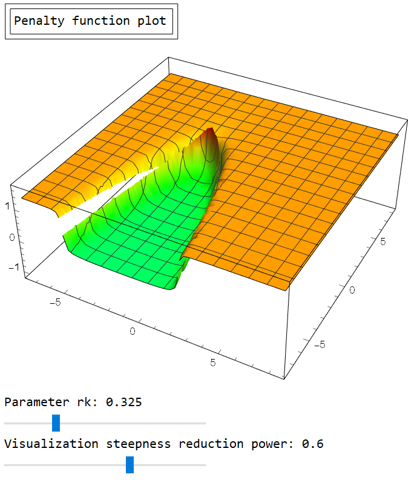

## Usage

Config parameters at the top of each package to select function, method, precision, starting point, boundarier and etc. Minimization can be tracked real-time and most consequent plots support dynamics.

## Requirements

To launch Mathematica packages one may need a valid Wolfram Mathematica license. As an alternative packages can be converted to Jypiter notebooks and executed with Wolfram Lang.

## Version History

* 01.01
    * Translated package 8, converted notebook to Mathematica package
    * Final touches to docs and comments

* 00.06
    * Translated package 7, converted notebook to Mathematica package

* 00.05
    * Translated package 6, converted notebook to Mathematica package
    * Improved method descriptions

* 00.04
    * Translated package 5, converted notebook to Mathematica package

* 00.03
    * Translated package 4, converted notebook to Mathematica package

* 00.02
    * Translated package 3, converted notebook to Mathematica package

* 00.01
    * Translated package 1, altered some plotting methods, converted notebook to Mathematica package
    * Translated package 2, altered some plotting methods, converted notebook to Mathematica package

## License

This project is licensed under the MIT License - see the LICENSE.md file for details
