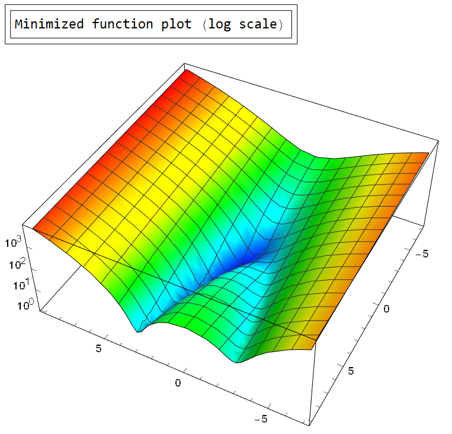
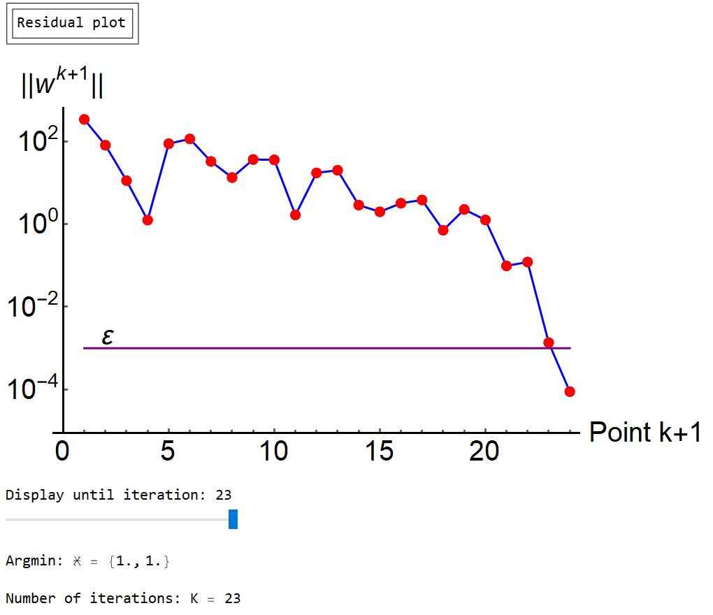

# Optimization methods collection

Contains various minimization methods in 7 Wolfram Mathematica packages:

* Package 1 (variations of 1-dimensional dichotomy)
    * Dichotomy method
    * Golden-section search

* Package 2 (variations of gradient descent)
    * Steepest descent
    * Gradient descent with geometric step reduction

* Package 3 (variations of nonlinear conjugate gradient method)
    * Nonlinear conjugate gradient method
    * Fletcher-Reeves method
    * Polak-Ribière method
    * Nonlinear conjugate gradient method with Hessian matrix

* Package 4 (variations of Newton's method)
    * Newton's method
    * Modified Newton's method with step reduction

* Package 5 (Quasi-Newton methods)
    * Davidon-Fletcher-Powell method
    * Broyden-Fletcher-Goldfarb - Shanno method
    * Powell method
    * McCormick method

* Package 6 (various direct search methods)
    * Cyclic coordinate descent
    * Pattern search (Hooke - Jeeves method)
    * Rosenbrock method
    * Powell method

* Package 7 (various simplex methods)
    * Regular simplex method
    * Downhill simplex method (Nelder\[Dash]Mead method)

* Package 8

## Package 1 (variations of 1-dimensional dichotomy) examples

Minimization of a single argument function on a given interval. Both methods have exponential convergence.

## Package 2 (variations of gradient descent) examples

* Requires gradient to be present and computable

Minimization of a 2-argument function from a given initial point. Rosenbrock function is used for testing, minization process can be dynamically tracked. All consequent plots support dynamics. Following example showcases steepest descent method.

## Package 3 (variations of nonlinear conjugate gradient method) examples

* Requires gradient to be present and computable
* Conjugate gradient methods can follow narrow (ill-conditioned) valleys, where the steepest descent method slows down and follows a criss-cross pattern

Minimization of a 2-argument function from a given initial point. Rosenbrock function is used for testing, minization process can be dynamically tracked. Following example showcases nonlinear conjugate gradient method with Hessian matrix.

## Package 4 (variations of Newton's method) examples

* Requires Hessian to be present and computable
* Newton's method can minimize any polynomial of Nth order in N-1 steps

Minimization of a 2-argument function from a given initial point. Rosenbrock function is used for testing, minization process can be dynamically tracked. Following example showcases modified Newton's method with step reduction.

## Package 5 (Quasi-Newton methods) examples

* Quasi-Newton methods (except McCormick) keep most properties of a regular Newton's method without requiring Hessian computation

Minimization of a 2-argument function from a given initial point. Rosenbrock function is used for testing, minization process can be dynamically tracked. Following example showcases Powell method. 

## Package 6 (various direct search methods) examples

* Direct search methods do not require a gradient, thus can be used with non-continuous and non-differentiable functions

Minimization of a 2-argument function from a given initial point. Rosenbrock function is used for testing, minization process can be dynamically tracked. Following example showcases cyclic coordinate descent.

## Package 7 (various simplex methods) examples

* Simplex methods do not require a gradient, thus can be used with non-continuous and non-differentiable functions

Minimization of a 2-argument function from a given initial point. Rosenbrock function is used for testing, minization process can be dynamically tracked. Following example showcases Nelder-Mead method.

## Package 8 examples

## Usage

Config parameters at the top of each package to select function, method, precision, starting point, boundarier and etc. Minimization can be tracked real-time and most consequent plots support dynamics.

## Requirements

To launch Mathematica packages one may need a valid Wolfram Mathematica license. As an alternative packages can be converted to Jypiter notebooks and executed with Wolfram Lang.

## Version History

* 00.06
    * Translated package 7, converted notebook to Mathematica package

* 00.05
    * Translated package 6, converted notebook to Mathematica package
    * Improved method descriptions

* 00.04
    * Translated package 5, converted notebook to Mathematica package

* 00.03
    * Translated package 4, converted notebook to Mathematica package

* 00.02
    * Translated package 3, converted notebook to Mathematica package

* 00.01
    * Translated package 1, altered some plotting methods, converted notebook to Mathematica package
    * Translated package 2, altered some plotting methods, converted notebook to Mathematica package

## License

This project is licensed under the MIT License - see the LICENSE.md file for details
